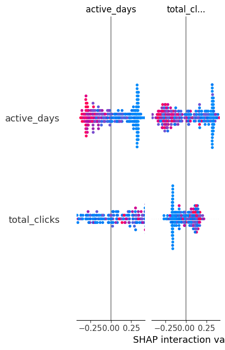

# Student Risk Prediction System (AI + ML Web Application)

An end-to-end machine learning and AI system that predicts student academic risk using the Open University Learning Analytics Dataset (OULAD), enhanced with an interactive LLM-powered assistant (Nova) and a full Streamlit web interface.

---

## Overview

This project is a full-stack machine learning application that:

- Predicts student academic risk using a Random Forest model
- Provides probability-based risk scoring
- Uses the Open University Learning Analytics Dataset (OULAD)
- Includes explainable intervention recommendations
- Integrates a local LLM assistant (Nova) for real-time student/data Q&A
- Provides an interactive Streamlit web interface for end users

The system was developed as part of a personal data science and AI portfolio project focused on educational analytics and applied machine learning systems.

---

## Key Features

### Machine Learning System
- Random Forest classification model
- Risk probability scoring
- Feature-based prediction pipeline

### AI-Powered Insights
- Student-level risk predictions
- Automated intervention suggestions
- Outcome improvement strategies

### Nova AI Assistant (LLM Integration)
- Natural language interface for dataset questions
- Explains predictions and risk factors
- Runs locally using Ollama (Llama 3)

### Web Application (Streamlit)
- Upload custom datasets (CSV)
- Or use built-in OULAD dataset
- Interactive dashboard
- Real-time predictions and AI chat

---

## Project Structure

```
Student Risk Prediction System/
│
├── data/
│   └── studentInfo.csv
│
├── src/
│   ├── app.py
│   ├── model.py
│   └── pipeline.py
│
├── notebooks/
│   └── 01_exploration.ipynb
│
├── requirements.txt
├── README.md
└── .gitignore
```

---

## How to Run the Project (Step-by-Step)

### 1. Clone the repository
```bash
git clone https://github.com/braxtonvogel/student-risk-prediction-system.git
cd student-risk-prediction-system
```

---

### 2. Create a virtual environment (recommended)
```bash
python -m venv venv
```

Activate it:

**Windows:**
```bash
venv\Scripts\activate
```

---

### 3. Install dependencies
```bash
pip install -r requirements.txt
```

---

### 4. Install and run Ollama (for AI assistant)

Download Ollama:
https://ollama.com/download

Then install the model used by the app:
```bash
ollama run llama3
```

---

### 5. Run the Streamlit app
```bash
streamlit run src/app.py
```

Then open in your browser:
```
http://localhost:8501
```

---

## Example Output

### Risk Prediction Table

| Student ID | Risk Probability | Risk Level |
|------------|------------------|------------|
| 1042       | 0.82             | High       |
| 1155       | 0.34             | Medium     |
| 1190       | 0.12             | Low        |

---

## Model Explainability (SHAP)
This project uses SHAP (SHapley Additive exPlanations) to analyze feature importance and feature interactions within the student risk prediction model. The visualization below demonstrates how variables such as active_days and total_clicks interact to influence student risk predictions.



---

### AI Assistant (Nova)

User: What does a high risk score mean?

Nova:
A high risk score indicates the student is more likely to fail or withdraw based on historical behavioral and academic patterns. Recommended interventions include tutoring, advisor meetings, and study plan adjustments.

---

## Technologies Used

- Python
- Pandas
- Scikit-learn
- Streamlit
- Ollama (Llama 3 LLM)
- Jupyter Notebook (initial experimentation)
- Git and GitHub (version control)

---

## Future Improvements

- Deploy application to cloud (Streamlit Cloud, AWS, or Azure)
- Improve ML model using advanced algorithms (XGBoost or Neural Networks)
- Add real-time database integration for live student tracking
- Enhance LLM reasoning for deeper educational insights
- Build role-based dashboards (teacher, advisor, student views)
- Improve feature engineering for better prediction accuracy
- Add authentication system for secure access
